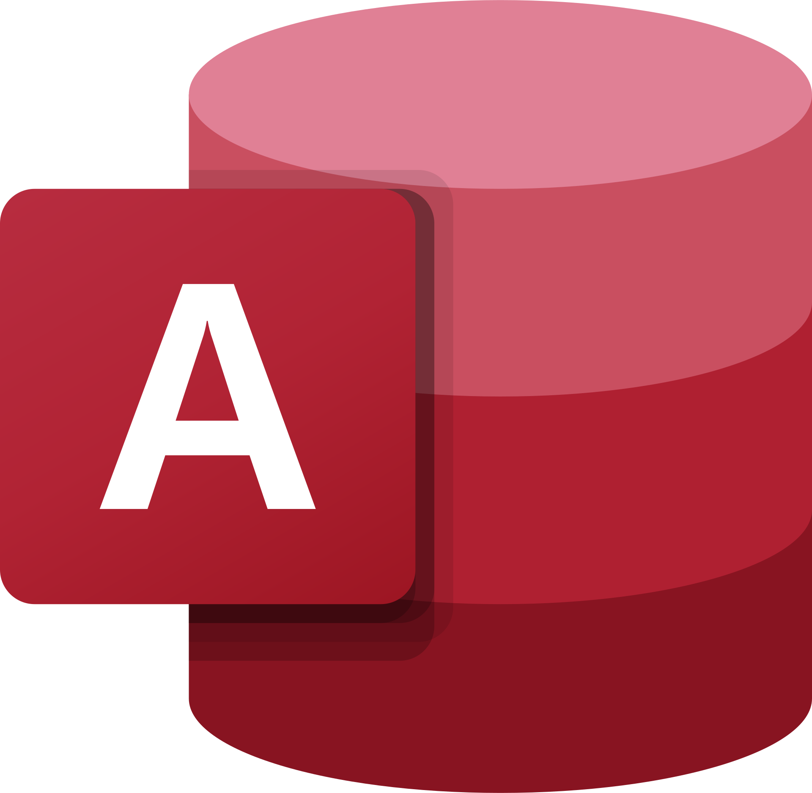

### Stats
<table style="border-color: transparent; margin-left: auto; margin-right: auto">
   <tr>
      <td>
          
      </td>
      <td>
         
      </td>
   </tr>
</table>
   

### Skills 

  
 

  
  
 
 
  
  
  
   
   
  
  
  

 

 

### Experience

- <b>Computer Science Tutor</b> (Delaware State University)
- <b>Technical Instructor Assistant</b> (Code Differently)
- <b>Software Engineer Intern</b> (Dormshops)

### Certifications

- <a href="https://www.coursera.org/account/accomplishments/professional-cert/8Y3XBW4Q2JHT" style="color: white">Google - User Experience Design Specialization</a>
- <a href="https://www.coursera.org/account/accomplishments/professional-cert/8Y3XBW4Q2JHT" style="color: white">Hackerrank - Python</a>
- <a href="https://www.coursera.org/account/accomplishments/professional-cert/8Y3XBW4Q2JHT" style="color: white">Hackerrank - Java</a>

### Ways to Connect to Me

